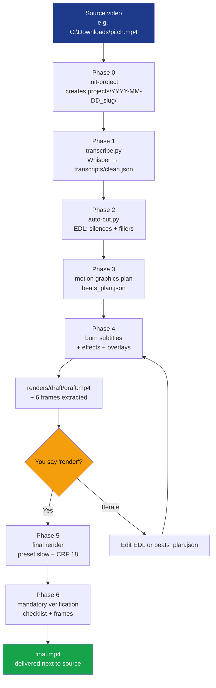

<div align="center">
  

  # videokit

  **Autonomous video editor as a Claude Code Skill.**

  Whisper transcription · Auto-cut · Burned-in subtitles · Motion graphics · Cinematic LUTs · 16:9 → 9:16 reframe · Diarization · Translation · TTS · Audio separation · Background removal

  [](#authorship)
  [](https://docs.anthropic.com/en/docs/claude-code)
  [](https://ffmpeg.org)
  [](https://python.org)

  **Languages:** English · [Português](README.md)

</div>

---

## Index

- [What it is](#what-it-is)
- [Features](#features)
- [How it works](#how-it-works)
- [Installation](#installation)
- [How to use — step by step](#how-to-use--step-by-step)
- [Complete project structure](#complete-project-structure)
- [Limitations](#limitations)
- [Roadmap](#roadmap)
- [Lessons learned](#lessons-learned-ffmpeg-8x-gotchas)
- [Authorship](#authorship)

---

## What it is

Conversational automatic video editor. You give it a video, tell it what you want, it does it. Operations available: transcription, silence/filler cutting, burned-in subtitles, motion graphics, color grading with LUTs, transitions, 9:16 reframe, professional audio, diarization, translation, TTS narration, stem separation, and background removal — all from a single instruction in Claude Code, without touching scripts manually.

**Differentiators:**
- Conversational (no need to learn FFmpeg arguments)
- Cross-platform (Windows PowerShell + macOS/Linux Bash)
- Auto-installs prerequisites (FFmpeg, Python, pip packages) with permission
- Output next to source — never inside the skill
- Mandatory verification before declaring "done" (checklist + 6 frames)

---

## Features

### Core pipeline (always available)

| Capability | Implementation |
|---|---|
| **Transcription** | Whisper local (default, offline, free), OpenAI API or ElevenLabs API |
| **Auto-cut** | Removes silences >0.5s, fillers in PT (`ahn`, `tipo`, `né`, `pronto`...) and EN (`um`, `like`, `you know`...) |
| **Burned-in subtitles (ASS)** | 3 styles: `full` (1-2 lines), `karaoke` (word-by-word), `highlights` (large key words) |
| **Motion graphics** | HTML title cards and lower thirds with alpha (Google Fonts, CSS animations) |
| **16:9 → 9:16 reframe** | Face tracking via MediaPipe BlazeFace. Optional X+Y tracking. Supports 9:16, 1:1, 4:5 |
| **LUTs and color grading** | 13 procedural LUTs (`identity`, `warm`, `cool`, `cinematic`, `bw`, `pastel`, `vintage`, `noir`, `vibrant`, `faded`, `golden-hour`, `teal-cool`, `high-contrast`) + vignette + film grain |
| **Transitions** | 40+ via FFmpeg `xfade` (fade, slide, wipe, circleopen, dissolve, radial, pixelize...) |
| **Professional audio** | RNNoise denoise + EBU R128 normalize (-14 LUFS YouTube / -16 Reels / -13 TikTok) + compressor + de-esser + music sidechain ducking |
| **Mandatory verification** | Boolean checklist (duration, audio, codec, subtitles) + ≥6 frames extracted for visual review |

### Advanced features (opt-in)

| Capability | Implementation | Trigger |
|---|---|---|
| **Diarization** | pyannote-audio identifies `SPEAKER_00`, `SPEAKER_01`... | `"podcast with 2 speakers"` |
| **Subtitle translation** | argos-translate offline PT↔EN/ES/FR/IT/DE (ASS and SRT) | `"translate subtitles to English"` |
| **TTS narration** | Piper local: voices PT-PT (tugão), PT-BR (faber/edresson), EN-US (amy/lessac), EN-GB (alan), ES, FR | `"generate narration for this text"` |
| **Audio separation** | Demucs separates vocals/drums/bass/other or two-stems | `"remove music from this video"` |
| **Background removal** | rembg/U²-Net without greenscreen (alpha / replace / blur) | `"remove background with blur"` |

---

## How it works



Simplified flow in 6 steps:
1. **Install** the skill once (clone + junction/symlink).
2. **Open** Claude Code in any folder.
3. **Tell** Claude `"edit this video <path>"`.
4. **First time:** answer 7 onboarding questions (brand color, style, etc.).
5. **Pipeline runs.** See draft + 6 frames. Confirm with `render`.
6. **Get** `final.mp4` in a `videokit-projects/` folder next to source.

---

## Installation

### Prerequisites

**The skill can install everything automatically** via `bootstrap.{ps1,sh}` (see [Step 4](#step-4--automatic-bootstrap-optional)). For reference:

| Tool | What for | Auto via skill? |
|---|---|---|
| **Claude Code** | Runtime | ❌ chicken-and-egg |
| **FFmpeg 8.x** with libass | Video/audio pipeline | ✅ via bootstrap |
| **Python 3.12+** | AI scripts | ✅ via bootstrap |
| **Core pip packages** (whisper, mediapipe, opencv) | Base pipeline | ✅ via bootstrap |
| **Feature pip packages** (pyannote, demucs, rembg...) | Advanced | ✅ via install-feature |
| **Node.js 22+** | HyperFrames (optional, future) | ❌ not used by default |

**On macOS**, the bootstrap requires [Homebrew](https://brew.sh):
```bash
/bin/bash -c "$(curl -fsSL https://raw.githubusercontent.com/Homebrew/install/HEAD/install.sh)"
```

**On Linux**, the bootstrap uses `apt` (Debian/Ubuntu). Other distros:
- Fedora: `sudo dnf install ffmpeg python3 python3-pip`
- Arch: `sudo pacman -S ffmpeg python python-pip`
- openSUSE: `sudo zypper install ffmpeg-7 python312 python312-pip`

### Step 1 — Clone this repository

**Windows (PowerShell):**
```powershell
cd $env:USERPROFILE\Documents
git clone https://github.com/antoniocostalopes/video-Kit.git videokit
```

**macOS / Linux:**
```bash
cd ~/Documents
git clone https://github.com/antoniocostalopes/video-Kit.git videokit
```

### Step 2 — Link to Claude Code

The skill must be visible in `~/.claude/skills/`. Symbolic link (no file duplication):

**Windows (PowerShell, no admin):**
```powershell
cmd /c mklink /J "$env:USERPROFILE\.claude\skills\videokit" "$env:USERPROFILE\Documents\videokit"
```

**macOS / Linux:**
```bash
ln -s ~/Documents/videokit ~/.claude/skills/videokit
```

### Step 3 — Verify

Open Claude Code (in any folder) and ask: `what skills do you have available?` You should see `videokit` in the list.

Or via terminal:
```powershell
Test-Path "$env:USERPROFILE\.claude\skills\videokit\SKILL.md"  # True
```

### Step 4 — Automatic bootstrap (optional)

The skill can auto-install FFmpeg, Python 3.12+, and core pip packages. If first invocation detects something missing, it offers to install. To do it manually:

**Windows (no admin, via winget):**
```powershell
& "$env:USERPROFILE\.claude\skills\videokit\scripts\bootstrap.ps1"
```

**macOS (requires Homebrew):**
```bash
bash ~/.claude/skills/videokit/scripts/bootstrap.sh
```

**Linux (Debian/Ubuntu, requires sudo):**
```bash
bash ~/.claude/skills/videokit/scripts/bootstrap.sh
```

Useful flags:
- `--auto-yes` / `-AutoYes` — no prompts, install everything
- `--check-only` / `-CheckOnly` — just report status
- `--skip-ffmpeg` / `--skip-python` / `--skip-pip` — skip components

### Step 5 — Environment detection (automatic on first use)

After bootstrap, the skill runs `scripts/detect-env.{ps1,sh}` which writes `cache/env-report.json` with FFmpeg/Python paths and available capabilities.

### On-demand feature packs

Advanced features (diarization, translation, TTS, audio separation, background removal) are opt-in. The skill asks before installing when you first request one. To install manually:

| Feature | Packages | Download | Notes |
|---|---|---|---|
| `core` | whisper + mediapipe + opencv-python | ~300MB | base, installed by bootstrap |
| `diarization` | pyannote.audio + torch | ~500MB | requires `HF_TOKEN` env var |
| `translation` | argostranslate | ~150MB | +100MB per language pair |
| `tts` | piper-tts | ~50MB | +50-100MB per voice |
| `audio-separation` | demucs + torch | ~2GB | includes models |
| `bg-removal` | rembg + opencv-python | ~250MB | includes U²Net |
| `all` | everything | ~5GB | one-shot |

```powershell
# Windows
.\install-feature.ps1 diarization
.\install-feature.ps1 all
```

```bash
# macOS / Linux
./install-feature.sh diarization
./install-feature.sh all
```

---

## How to use — step by step

### First use — onboarding (5 minutes, once)

When invoked for the first time, the skill asks 7 questions one at a time. Saved in `~/.claude/skills/videokit/styles/client-style.md`. Applies to all future videos.

> **You:** `configure videokit for my brand`
>
> **Claude:** I'll create your profile. Primary color? (hex, name, or `default`)
>
> **You:** `#2563EB`
>
> **Claude:** Secondary accent color?
>
> **You:** `default`
>
> **Claude:** Editing style? `minimalist` / `dynamic` / `corporate` / `educational`
>
> **You:** `dynamic`
>
> **Claude:** Where do you usually appear in frame? `center` / `right` / `left`
>
> **You:** `center`
>
> **Claude:** Logo? (absolute path or `no`)
>
> **You:** `no`
>
> **Claude:** Default subtitle style? `full` / `karaoke` / `highlights` / `none`
>
> **You:** `karaoke`
>
> **Claude:** Preferred transcriber? `Whisper local` / `OpenAI` / `ElevenLabs`
>
> **You:** `Whisper local`
>
> **Claude:** Style saved. I can now edit your videos. When ready, give me the path: `edit C:\path\video.mp4`.

### Typical session — full edit

> **You:** `edit this video C:\Downloads\ai-pitch.mp4`
>
> **Claude:** I'll create the project. Before starting:
>
> 1. Subtitle style for **this** video (default from your profile is karaoke)?
> 2. Mode: `full` (motion graphics) or `cut-only`?
> 3. Any context I should know? (technical terms, focus)
>
> **You:** `karaoke, full, it's a pitch about AI agents with terms "MCP", "RAG", "embedding"`
>
> **Claude:**
> ```
> Running detect-env... ✓
> Creating C:\Downloads\videokit-projects\2026-06-03_ai-pitch\
> Source detected: 1920×1080 @ 30fps, 4m12s, 16:9
>
> Phase 1/6 — Transcribing (Whisper medium, ~2min)...
> ✓ 87 segments, 1124 words (PT detected)
>
> Phase 2/6 — Analyzing for cuts...
> ✓ Silences: 23 (-12.4s) · Fillers: 41 · Final duration 3m26s
>
> Phase 3/6 — Motion graphics plan... ✓ 5 beats + 2 zoompan effects
>
> Phase 4/6 — Burning karaoke subtitles + overlays...
> Phase 5/6 — Generating draft (~1min)...
>
> ✓ Draft ready at renders/draft/draft.mp4
> ✓ 6 frames extracted to verify/
>
> Review and say 'render' for final, or request adjustments.
> ```
>
> **You:** `the zoom at 2m48s is exaggerated, reduce to 1.15× and render`
>
> **Claude:**
> ```
> Adjusting beats_plan.json.video_effects[id=vfx02].max_zoom: 1.25 → 1.15
> Regenerating phases 4-5 (preset slow, ~3min)...
>
> Phase 6/6 — Verification...
> ✓ Duration: 3m26s · Audio: -14 LUFS · Codec h264 yuv420p
> ✓ Subtitles synced · Zoom at 2m48s confirmed
>
> Done.
> 📁 C:\Downloads\videokit-projects\2026-06-03_ai-pitch\renders\final\final.mp4
> ⏱️ 3m26s · 87 MB · 6 review frames in verify/
> ```

### Commands cheatsheet

| When | What you say | Effect |
|---|---|---|
| **Start** | `edit C:\v.mp4` | Full pipeline `full` |
| **Start** | `cut silences in C:\v.mp4` | Mode `cut-only` |
| **Start** | `cut ums / likes in C:\v.mp4` | Cut-only with EN fillers |
| **Start** | `clean audio in C:\v.mp4` | Audio pack (denoise + normalize + compressor) |
| **Start** | `Reels version of C:\v.mp4` | Smart reframe 16:9 → 9:16 |
| **Start** | `Reels with vertical tracking` | Smart reframe X+Y |
| **Start** | `square version of C:\v.mp4` | Smart reframe 1:1 |
| **Start** | `who speaks when in C:\podcast.mp4?` | Diarization (SPEAKER_NN) |
| **Start** | `podcast with 2 speakers, add names to subtitles` | Diarize + named subtitles |
| **Start** | `remove music from C:\v.mp4` | Demucs separates, keeps voice |
| **Start** | `isolate voice for karaoke` | Demucs vocals + no_vocals |
| **Start** | `remove background of C:\v.mp4 with blur` | rembg blur mode |
| **Start** | `replace background with image C:\bg.jpg` | rembg replace mode |
| **Start** | `generate narration with PT voice` | Piper TTS pt_PT-tugao |
| **Before transcribing** | `use OpenAI Whisper instead of local` | Override transcriber |
| **After draft** | `render` / `looks good` | Proceed to final |
| **After draft** | `change subtitle color to red` | Edit ASS + re-render |
| **After draft** | `remove the intro card` | Remove beat[0] |
| **After draft** | `speed up 1.1× from 1m30s` | setpts in beats_plan |
| **After draft** | `also 9:16 version` | Smart reframe post-final |
| **After draft** | `translate subtitles to English` | argos-translate ASS → EN |
| **After final** | `apply cinematic look` | LUT cinematic + grade |
| **After final** | `apply pastel look` | LUT pastel + grade |
| **After final** | `apply golden hour look` | LUT golden-hour + grade |
| **After final** | `apply noir look` | LUT noir + high contrast |

### How to iterate after first render

Visual changes are fast — the skill touches only what's affected:

| Request | What changes | Time |
|---|---|---|
| `change subtitle color to green` | `edit/subtitles.ass` → re-burn | ~30s |
| `move lower-third to 45s` | `beats_plan.json` timestamp → recompose | ~30s |
| `remove zoom at 2m48s` | `beats_plan.json.video_effects` → re-render base | ~1min |
| `also cut at 1m20s` | `edit/edl.json` → re-cut → re-render | ~3min (timestamps shift) |
| `apply warm LUT instead of cinematic` | re-run visual-effects | ~1min |
| `also 9:16 version of this final` | smart-reframe post-final | ~3min (1080p 1min) |

The skill **warns** when a change requires re-running earlier phases.

### Scenarios by video type

#### 1. Talking head for long YouTube (16:9)
```
edit C:\Videos\episode-03.mp4 with full subtitles and corporate look
```
16:9 1920×1080, white subtitles with black outline, discrete lower thirds, audio normalized -14 LUFS.

#### 2. Instagram Reel/Short (9:16)
```
edit C:\Videos\hook.mp4 with karaoke subtitles and Reels version
```
16:9 pipeline → smart-reframe 9:16 1080×1920. Karaoke word-by-word font 110px. Audio -16 LUFS.

#### 3. Quick cleanup without motion graphics
```
cut silences and "ums" in C:\Videos\raw.mov, no motion graphics
```
Cut-only mode. EDL + concat + (optional) subtitles. Ideal for video podcast, long interview.

#### 4. Podcast — audio pack standalone
```
clean audio in C:\Audio\episode.mp4 and normalize to -16 LUFS for podcast
```
No video pipeline. Denoise RNNoise + de-esser + compressor + EBU R128 -16 LUFS.

#### 5. Screencast / tutorial
```
edit C:\Videos\demo.mp4, it's a code tutorial, zoom on demos
```
Screencast profile: discrete subtitles, subtle zoom (1.15×) on demos, no side cards.

#### 6. Cinematic promo
```
edit C:\Videos\promo.mp4 with cinematic look, vignette, and highlights subtitles
```
LUT cinematic.cube (teal-orange) + vignette 0.4 + film grain 5 + highlights on key words.

#### 7. Podcast with 2 speakers and diarization
```
edit C:\Podcasts\ep-12.mp4, diarize the 2 speakers and add subtitles with names
```
Cut-only + `diarize.py --num-speakers 2`. Skill asks for real names ("John", "Maria") and prefixes each ASS Dialogue.

#### 8. Multi-language video (EN/ES/FR subtitles)
```
edit C:\Videos\pitch-pt.mp4 and generate versions with EN, ES, FR subtitles
```
PT pipeline → `translate-subtitles.py` per language → burned outputs or external SRTs.

#### 9. TTS-generated narration
```
generate narration with PT voice for the text in C:\scripts\intro.txt, mix with music C:\music\loop.mp3
```
`narrate.py --voice pt_PT-tugao --text-file intro.txt` → `audio-process.sh` automatic ducking.

#### 10. Webcam look (background blur)
```
remove background of C:\Videos\talking.mp4 with blur, keep quality
```
`remove-bg.py --mode blur --blur-strength 25`. "Pro webcam" look without greenscreen.

#### 11. Replace video music
```
remove music from C:\Videos\vlog.mp4 and add C:\music\new.mp3 with low volume
```
`separate-audio.py --two-stems vocals` + `audio-process.sh --music new.mp3 --music-volume 0.3`.

### Where outputs go

**Not inside the skill.** Next to the source video:

```
C:\Downloads\
├── ai-pitch.mp4                                  ← your source (intact)
└── videokit-projects\
    └── 2026-06-03_ai-pitch\
        ├── source\ai-pitch.mp4                   ← local copy
        ├── transcripts\
        │   ├── raw.json                          ← raw Whisper output
        │   ├── clean.json                        ← canonical format
        │   └── diarization.json                  ← if diarized
        ├── edit\
        │   ├── edl.json                          ← edit here for cuts
        │   ├── subtitles.ass                     ← edit here for subtitles
        │   ├── subtitles_en.ass                  ← if translated
        │   └── segments\seg_001.mp4 ...
        ├── overlays\b01.mov, b02.mov, ...        ← motion graphics alpha
        ├── audio\stems\vocals.wav ...            ← if separated with demucs
        ├── renders\
        │   ├── draft\draft.mp4                   ← fast preview
        │   └── final\final.mp4                   ⬅ DELIVERY
        ├── verify\
        │   ├── frame_1.000.png                   ← control
        │   └── ...                                ← ≥6 frames
        ├── cache\                                 ← temporaries (deletable)
        ├── project.json                          ← complete state
        ├── beats_plan.json                       ← motion graphics
        └── notes.md                              ← decisions and exceptions
```

Delete `2026-06-03_ai-pitch/` to clean up everything for that video. Your source in `Downloads\` stays intact.

### Flags via slash command (alternative to conversation)

```
/videokit C:\v.mp4 --mode cut-only --subs karaoke
/videokit C:\v.mp4 --mode full --subs highlights
/videokit C:\v.mp4 --mode full --subs none
```

`argument-hint` in SKILL.md: `<absolute-video-path> [--mode full|cut-only] [--subs full|karaoke|highlights|none]`.

---

## Complete project structure

```
videokit/
├── SKILL.md                    # Manifest + main flow (read by Claude)
├── README.md                   # Portuguese version
├── README.en.md                # This file (English)
├── CHANGELOG.md                # Keep a Changelog + semver
├── CONTRIBUTING.md             # PR guidelines + code style
├── .gitignore                  # Ignores cache, runtime models, private config
├── .github/
│   └── workflows/
│       └── validate.yml        # CI: PowerShell + Python + Bash + Markdown lint
│
├── reference/                  # 13 on-demand docs (read by Claude as needed)
│   ├── pipeline.md             # 6 pipeline phases (input → delivery)
│   ├── formats.md              # specs 16:9 / 9:16 / 1:1 / screencast (safe zones)
│   ├── onboarding.md           # first conversation (7 questions)
│   ├── subtitle-styles.md      # when to use full / karaoke / highlights
│   ├── audio-pack.md           # RNNoise denoise + loudnorm + ducking
│   ├── visual-effects.md       # xfade transitions + 13 LUTs + grading
│   ├── smart-reframe.md        # MediaPipe X+Y tracking
│   ├── diarization.md          # pyannote-audio SPEAKER_NN
│   ├── translation.md          # argos-translate offline
│   ├── tts.md                  # Piper TTS multi-language
│   ├── audio-separation.md     # Demucs stem separation
│   ├── background-removal.md   # rembg without greenscreen
│   └── lessons-learned.md      # FFmpeg 8.x, Windows, Whisper gotchas
│
├── scripts/                    # 27 scripts: 9 PowerShell + 9 Bash + 9 Python
│   │
│   │ ─── Setup and environment ───
│   ├── bootstrap.{ps1,sh}      # Auto-install FFmpeg + Python + pip core
│   ├── install-feature.{ps1,sh} # Install pip packages per feature pack
│   ├── detect-env.{ps1,sh}     # Detect env, write cache/env-report.json
│   ├── download-assets.{ps1,sh} # Fetch runtime models (RNNoise)
│   │
│   │ ─── Pipeline ───
│   ├── init-project.{ps1,sh}   # Create videokit-projects/YYYY-MM-DD_slug/
│   ├── transcribe.py           # Whisper local + OpenAI + ElevenLabs
│   ├── auto-cut.py             # EDL: silences + fillers PT/EN/retakes
│   ├── burn-subtitles.{ps1,sh} # Burn ASS via ffmpeg subtitles filter
│   ├── audio-process.{ps1,sh}  # Denoise + normalize + compressor + ducking
│   ├── visual-effects.{ps1,sh} # Modes: transition / lut / grade
│   ├── render.{ps1,sh}         # Orchestrator (cut/subs/effects/overlays/verify)
│   │
│   │ ─── Advanced features ───
│   ├── smart-reframe.py        # MediaPipe BlazeFace tracking X+Y
│   ├── diarize.py              # pyannote SPEAKER_NN + merge transcript
│   ├── translate-subtitles.py  # argos-translate ASS/SRT cross-language
│   ├── narrate.py              # Piper TTS PT-PT/PT-BR/EN/ES/FR
│   ├── separate-audio.py       # Demucs vocals/drums/bass/other
│   ├── remove-bg.py            # rembg alpha/replace/blur
│   │
│   │ ─── Generators ───
│   └── gen-luts.py             # Generates 13 procedural .cube LUTs
│
├── assets/
│   ├── icon.svg                # Skill logo (140×140 in README)
│   ├── subtitle-templates/     # 3 .ass templates (UTF-8 no BOM)
│   │   ├── full.ass            # 1-2 complete lines
│   │   ├── karaoke.ass         # word-by-word with {\k}
│   │   └── highlights.ass      # large key words (alignment 5)
│   ├── beat-templates/         # 2 HTML templates with alpha
│   │   ├── title-card.html     # Large title + subtitle (fade-in)
│   │   └── lower-third.html    # Name + role (slide-in left/right/center)
│   ├── luts/                   # 13 procedural LUTs (134KB each)
│   │   ├── identity.cube       # no effect (baseline)
│   │   ├── warm.cube           # golden hour, sunset
│   │   ├── cool.cube           # winter, tech
│   │   ├── cinematic.cube      # classic teal-orange
│   │   ├── bw.cube             # B&W soft contrast
│   │   ├── pastel.cube         # lifestyle, wellness
│   │   ├── vintage.cube        # sepia, faded blacks
│   │   ├── noir.cube           # B&W high contrast + blue shadows
│   │   ├── vibrant.cube        # high saturation + S-curve
│   │   ├── faded.cube          # Instagram filter classic
│   │   ├── golden-hour.cube    # warm intense, magic hour
│   │   ├── teal-cool.cube      # modern tech, saturated cool
│   │   └── high-contrast.cube  # bold blacks + brights
│   ├── audio-models/           # RNNoise cb.rnnn (runtime download, gitignored)
│   ├── face-detector/          # BlazeFace .tflite (runtime download, gitignored)
│   └── voice-models/           # Piper .onnx (runtime download, gitignored)
│
└── cache/                      # env-report.json (local state, gitignored)
```

---

## Limitations

- **Single-pass loudnorm**: ~0.5 LUFS imprecision vs. two-pass. Acceptable for digital content.
- **Smart reframe X+Y**: face tracking works well; in very rapid movement may have "jumps".
- **CPU Whisper**: ~5× real-time at 1080p with `medium` model. NVIDIA GPU 10× faster but needs CUDA setup.
- **No chroma key removal**: greenscreen requires pre-processing.
- **Diarization in PT**: reasonable; very similar voices (same gender/age) may confuse.
- **Other Linux distros**: bootstrap only auto-supports apt (Debian/Ubuntu). Others need manual.
- **macOS Homebrew**: chicken-and-egg — must install brew first (one curl line).

---

## Roadmap

Planned features (PRs welcome):

- [ ] **Automatic B-roll** via Pexels API
- [ ] **Automatic chapter markers** — YouTube chapters file
- [ ] **Stable Diffusion thumbnails** — frame + title overlay
- [ ] **Hook detection** — strongest first 3-5s for Reels auto-trim
- [ ] **GPU end-to-end** — NVENC + Whisper.cpp + CUDA OpenCV (10× speedup)
- [ ] **Multi-format auto-export** — 1 source → YouTube 16:9 + Reels 9:16 + Square 1:1 in parallel
- [ ] **Auto-thumbnail** with frame + title overlay
- [ ] **Watch folder mode** — daemon that monitors folder
- [ ] **Pyannote refinement** — diarization with voice samples (real name)
- [ ] **NLLB-200** alternative to argos-translate (200 languages, superior quality)
- [ ] **Tests** (Pester + pytest)
- [ ] **Real-time progress** via JSON stdout

### Already implemented in this version

- ✅ **Core pipeline** — transcribe, auto-cut, burn-subtitles, motion graphics, verify
- ✅ **Audio pack** — RNNoise denoise, EBU R128, compressor, ducking
- ✅ **Visual pack** — 40+ xfade transitions, 13 procedural LUTs, vignette, film grain
- ✅ **Smart reframe** 16:9 → 9:16/1:1/4:5 with X+Y tracking (MediaPipe)
- ✅ **Diarization** pyannote-audio with SPEAKER_NN
- ✅ **Translation** argos-translate PT↔EN/ES/FR/IT/DE
- ✅ **Local TTS** Piper with 8 catalogued voices
- ✅ **Audio separation** Demucs (4-stem or two-stems)
- ✅ **Background removal** rembg/U²-Net (alpha/replace/blur)
- ✅ **Auto-install** FFmpeg + Python + pip core via bootstrap
- ✅ **Feature packs** install-feature per functionality
- ✅ **Cross-platform** Windows + macOS + Linux (PS + Bash)
- ✅ **GitHub Actions CI** validate.yml for PRs

---

## Lessons learned (FFmpeg 8.x gotchas)

In `reference/lessons-learned.md` I document real bugs and workarounds. Examples:

- **`crop` with `t` in FFmpeg 8.x doesn't re-evaluate filter per frame** → temporal zoom freezes. Use `zoompan` with `in_time` (`d=1`).
- **`-c copy` alone in cuts desyncs AAC packets** → always `-c:a aac -b:a 192k`.
- **`subtitles` filter in Windows doesn't accept paths with `:`** → copy `.ass` to output folder and reference by name (`Push-Location`).
- **iPhone MOV multi-stream** (AAC + spatial 4ch) → `-map 0:a:0` to grab right stereo.
- **PowerShell 5.1 treats native exe stderr as error** → `Start-Process -RedirectStandardError` instead of `2>&1`.
- **Python `subprocess` PIPE with ffmpeg can deadlock** → stderr to tempfile, not PIPE.
- **MediaPipe 0.10.x removed `mp.solutions`** → use Tasks API with `.tflite` downloaded.
- **PowerShell `$Input`** is reserved → use `$InputFile` in parameters.

If you find an FFmpeg bug in a scenario not covered, open an issue or PR with the workaround.

---

## Authorship

**videokit** was conceived, architected, and developed by **Antonio Costa Lopes** in 2026.

© 2026 Antonio Costa Lopes.

This repository does not declare a public license. The code is authored by the author and subject to applicable automatic copyright (Berne Convention). For usage discussions, open an [issue](https://github.com/antoniocostalopes/video-Kit/issues).

### Third-party components

videokit is an orchestrator that invokes external tools. These tools retain their own licenses and terms of use — they are not redistributed by this repository:

- **FFmpeg** — LGPL/GPL ([ffmpeg.org/legal.html](https://ffmpeg.org/legal.html))
- **OpenAI Whisper** — MIT
- **MediaPipe BlazeFace** — Apache 2.0 (Google, `.tflite` model runtime download)
- **pyannote-audio** — MIT (but `speaker-diarization-3.1` model requires accepting HuggingFace terms)
- **argos-translate** — MIT (language packs CC-BY)
- **Piper TTS** — MIT (voices have individual licenses, mostly permissive)
- **Demucs** — MIT (Facebook AI Research)
- **rembg + U²-Net** — Apache 2.0
- **RNNoise** model `cb.rnnn` — Creative Commons Attribution 4.0 (CC-BY 4.0), by GregorR ([github.com/GregorR/rnnoise-models](https://github.com/GregorR/rnnoise-models))
- **OpenCV** — Apache 2.0
- **PyTorch** — BSD

The scripts `download-assets.{ps1,sh}`, `smart-reframe.py`, `narrate.py`, `separate-audio.py`, `remove-bg.py`, `diarize.py`, and `translate-subtitles.py` download models directly from official sources. No models are included in this repository (all `.gitignored`).

---

<div align="center">
  <sub>Built for Claude Code · Antonio Costa Lopes · 2026</sub>
</div>
