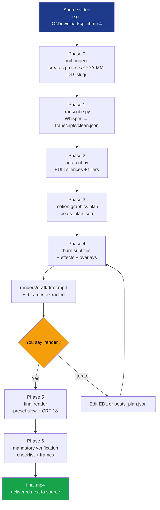

<div align="center">
  

  # videokit

  **Autonomous video editor as a Claude Code Skill.**

  Whisper transcription · Auto-cut · Burned-in subtitles · Motion graphics · Cinematic LUTs · 16:9 → 9:16 reframe with face tracking

  [](#authorship)
  [](https://docs.anthropic.com/en/docs/claude-code)
  [](https://ffmpeg.org)
  [](https://python.org)

  **Languages:** English · [Português](README.md)

</div>

---

## What it does

You give it a video. It transcribes, cuts silences and fillers, generates subtitles, applies visual effects, optionally creates motion graphics, exports multi-format, and verifies the result before delivery. All from a single conversational instruction in Claude Code.

| Capability | Implementation |
|---|---|
| **Transcription** | Whisper local (default, offline, free) or OpenAI/ElevenLabs API |
| **Auto-cut** | Removes silences >0.5s, fillers in PT (`ahn`, `tipo`, `né`) and EN (`um`, `like`) |
| **Burned-in subtitles** | 3 ASS styles: `full`, `karaoke` (word-by-word), `highlights` |
| **LUTs and color grading** | 13 procedural LUTs (warm/cool/cinematic/bw/pastel/vintage/noir/vibrant/faded/golden-hour/teal-cool/high-contrast/identity) + vignette + film grain |
| **Transitions** | 40+ via FFmpeg `xfade` (fade, slide, wipe, circleopen, dissolve...) |
| **Professional audio** | RNNoise denoise + EBU R128 normalize + compressor + music ducking |
| **16:9 → 9:16 reframe** | Face tracking via MediaPipe BlazeFace with X+Y tracking option (also 1:1 and 4:5) |
| **Motion graphics** | HTML title cards and lower thirds with alpha |
| **Diarization** | pyannote-audio identifies `SPEAKER_00`, `SPEAKER_01`... for speaker-labeled subtitles |
| **Subtitle translation** | argos-translate PT↔EN/ES/FR/IT/DE (ASS and SRT) offline |
| **TTS narration** | Piper local: voices PT-PT (tugão), PT-BR (faber), EN-US/GB, ES, FR |
| **Audio separation** | Demucs separates vocals/drums/bass/other — remove music, isolate voice, karaoke |
| **Background removal** | rembg/U²-Net without greenscreen — alpha, replace, blur modes |
| **Mandatory verification** | Boolean checklist + ≥6 frame extraction before declaring "done" |

---

## How it works

1. **Install the skill once** (instructions below).
2. **Open Claude Code in any folder** — no need to prepare directories, copy files, or create `input/`.
3. **Tell Claude what you want**:
   ```
   edit this video C:\Downloads\pitch.mp4
   ```
   Or variants:
   ```
   cut silences in D:\raw\interview.mov
   clean the audio of pitch.mp4
   Reels version of pitch.mp4
   apply cinematic look to pitch.mp4
   ```
4. **First time:** answer 7 onboarding questions (color, style, speaker position, etc.). Saved in `~/.claude/skills/videokit/styles/client-style.md`.
5. **Pipeline runs.** You see a draft + 6 extracted frames. You say `render`.
6. **You get `final.mp4`** next to the source video, inside `videokit-projects/YYYY-MM-DD_slug/renders/final/`.

---

## Installation

### Prerequisites

**The skill can install everything automatically** via `bootstrap.{ps1,sh}` (see Step 4). For reference:

| Tool | What for | How to install (manual) | Auto via skill? |
|---|---|---|---|
| **Claude Code** | Skill runtime | [docs.anthropic.com](https://docs.anthropic.com/en/docs/claude-code) | ❌ chicken-and-egg |
| **FFmpeg 8.x** with libass | Video/audio pipeline | `winget install Gyan.FFmpeg` (Win) / `brew install ffmpeg` (mac) / `apt install ffmpeg` (Linux) | ✅ via bootstrap |
| **Python 3.12+** | Transcription, cut, smart-reframe scripts | `winget install Python.Python.3.13` (Win) / `brew install python` (mac) | ✅ via bootstrap |
| **Core pip packages** (whisper, mediapipe, opencv) | Base pipeline | `pip install openai-whisper mediapipe opencv-python` | ✅ via bootstrap |
| **Feature pip packages** (pyannote, demucs, rembg, etc.) | Advanced features | `pip install <package>` | ✅ via install-feature |
| **Node.js 22+** (optional) | HyperFrames for advanced motion graphics | `winget install OpenJS.NodeJS.LTS` | ❌ not used by default |

**On macOS**, the bootstrap requires [Homebrew](https://brew.sh) installed beforehand (chicken-and-egg). If you don't have it:
```bash
/bin/bash -c "$(curl -fsSL https://raw.githubusercontent.com/Homebrew/install/HEAD/install.sh)"
```

**On Linux**, the bootstrap uses `apt` (Debian/Ubuntu). Other distros (Fedora, Arch, openSUSE) need to install FFmpeg + Python3 manually.

### Step 1 — Clone this repository

In any development folder of your choice:

**Windows (PowerShell):**
```powershell
cd $env:USERPROFILE\Documents
git clone https://github.com/antoniocostalopes/video-Kit.git videokit
```

**macOS / Linux:**
```bash
cd ~/Documents
git clone https://github.com/antoniocostalopes/video-Kit.git videokit
```

### Step 2 — Link to Claude Code

The skill must be visible in `~/.claude/skills/`. Create a symbolic link (no file duplication):

**Windows (PowerShell, no admin privileges required):**
```powershell
cmd /c mklink /J "$env:USERPROFILE\.claude\skills\videokit" "$env:USERPROFILE\Documents\videokit"
```

**macOS / Linux:**
```bash
ln -s ~/Documents/videokit ~/.claude/skills/videokit
```

### Step 3 — Verify

Open Claude Code (in any folder) and ask: `what skills do you have available?` You should see `videokit` in the list.

Or via terminal:
```powershell
Test-Path "$env:USERPROFILE\.claude\skills\videokit\SKILL.md"  # True
```

### Step 4 — Automatic bootstrap (optional)

The skill can **auto-install** FFmpeg, Python 3.12+, and the necessary pip packages. If first invocation detects something missing, it offers to install. To do it manually:

**Windows (no admin, via winget):**
```powershell
& "$env:USERPROFILE\.claude\skills\videokit\scripts\bootstrap.ps1"
```

**macOS (requires Homebrew):**
```bash
bash ~/.claude/skills/videokit/scripts/bootstrap.sh
```

**Linux (Debian/Ubuntu, requires sudo):**
```bash
bash ~/.claude/skills/videokit/scripts/bootstrap.sh
```

The bootstrap detects what you have and installs only what's missing. Flag `--auto-yes` to skip prompts; `--check-only` to only report.

### Step 5 — Environment detection (automatic on first use)

After bootstrap, the skill runs `scripts/detect-env.{ps1,sh}` which writes `cache/env-report.json` with FFmpeg/Python paths and available capabilities.

### On-demand feature packs

Advanced features (diarization, translation, TTS, audio separation, background removal) are opt-in. The skill asks before installing when you first request one. To install manually:

```powershell
# Windows
.\install-feature.ps1 diarization        # ~500MB
.\install-feature.ps1 translation        # ~150MB
.\install-feature.ps1 tts                # ~50MB
.\install-feature.ps1 audio-separation   # ~2GB
.\install-feature.ps1 bg-removal         # ~250MB
.\install-feature.ps1 all                # all (~5GB)
```

```bash
# macOS / Linux
./install-feature.sh diarization
./install-feature.sh translation
./install-feature.sh tts
./install-feature.sh audio-separation
./install-feature.sh bg-removal
./install-feature.sh all
```

---

## How to use — step by step

### Pipeline overview



### First use — onboarding (5 minutes, once)

When invoked for the first time, the skill doesn't have your visual identity defined yet. It asks 7 questions — one at a time — and saves to `~/.claude/skills/videokit/styles/client-style.md`. This config applies to all future videos.

Example session:

> **You:** `configure videokit for my brand`
>
> **Claude:** I'll create your brand profile. First question — what's your brand's primary color? You can give hex (`#2563EB`), name (`blue`, `red`...) or `default`.
>
> **You:** `#2563EB`
>
> **Claude:** And a secondary accent color?
>
> **You:** `default`
>
> **Claude:** What editing style do you prefer? `minimalist` / `dynamic` / `corporate` / `educational` — default is `minimalist`.
>
> **You:** `dynamic`
>
> **Claude:** Where do you usually appear in the frame? `center` / `right` / `left` — default `center`.
>
> **You:** `center`
>
> **Claude:** Do you have a logo? If yes, give absolute path. If not, say `no`.
>
> **You:** `no`
>
> **Claude:** Default subtitle style: `full` / `karaoke` / `highlights` / `none`.
>
> **You:** `karaoke`
>
> **Claude:** Preferred transcriber: `Whisper local` / `OpenAI` / `ElevenLabs`. Default `Whisper local`.
>
> **You:** `Whisper local`
>
> **Claude:** Style saved. I can now edit your videos with this look. When ready, give me the video path: `edit C:\path\to\video.mp4`.

Done. You don't need to do this again.

### Typical session — full edit

Let's edit a real video. Concrete conversation:

> **You:** `edit this video C:\Downloads\ai-pitch.mp4`
>
> **Claude:** I'll create the project. Before starting:
>
> 1. Subtitle style for **this** video (default from your profile is karaoke): keep or other?
> 2. Mode: `full` (with motion graphics) or `cut-only`?
> 3. Any context I should know? (technical terms, focus, audience)
>
> **You:** `karaoke, full, it's a pitch about AI agents with terms "MCP", "embedding", "RAG"`
>
> **Claude:**
> ```
> Running detect-env.ps1...
> ffmpeg: 8.1 ✓  ffprobe ✓  Whisper installed ✓
>
> Creating C:\Downloads\videokit-projects\2026-06-03_ai-pitch\
> Source detected: 1920×1080 @ 30fps, 4m12s, 16:9
>
> Phase 1/6 — Extracting audio and transcribing (medium model, ~2min)...
> ✓ 87 segments, 1124 words (PT detected)
>
> Phase 2/6 — Analyzing for auto-cut...
> ✓ Silences detected: 23 (12.4s removed)
> ✓ Fillers detected: 41 ("tipo", "ahn", "né"...)
> ✓ Final duration: 3m26s (cut 46s, 18%)
>
> Phase 3/6 — Planning motion graphics...
> ✓ 5 beats: 1 title card + 2 lower thirds + 2 highlights
> ✓ 2 zoompan effects (at 1m12s and 2m48s)
>
> Phase 4/6 — Burning karaoke subtitles and applying overlays...
> Phase 5/6 — Generating draft (~1min, preset ultrafast)...
>
> ✓ Draft ready: C:\Downloads\videokit-projects\2026-06-03_ai-pitch\renders\draft\draft.mp4
> ✓ 6 frames extracted to verify/
>
> Check the draft and say 'render' for final, or request adjustments.
> ```
>
> **You:** *(after watching draft)* `the zoom at 2m48s is exaggerated, reduce to 1.15× and render final`
>
> **Claude:**
> ```
> Adjusting beats_plan.json.video_effects[id=vfx02].max_zoom: 1.25 → 1.15
> Regenerating from phase 4 (preset slow, ~3min)...
>
> Phase 6/6 — Verification...
> ✓ Duration: 3m26s
> ✓ Audio present (-14 LUFS)
> ✓ Codec h264, yuv420p, 1920×1080
> ✓ Subtitles synced (sampling at 0:30, 1:45, 3:00)
> ✓ Zoom at 2m48s confirmed in verify/ frames
>
> Done. Delivery:
> 📁 C:\Downloads\videokit-projects\2026-06-03_ai-pitch\renders\final\final.mp4
> ⏱️ 3m26s · 1920×1080 · 87 MB
> 📸 6 review frames in verify/
> ```

That's it. Final file next to your original source. Delete the `2026-06-03_ai-pitch/` folder when you no longer need it.

### Commands during the session

Cheatsheet of what you can say to Claude at each phase:

| When | What you say | Effect |
|---|---|---|
| **Start** | `edit C:\v.mp4` | Full pipeline `full` |
| **Start** | `cut silences in C:\v.mp4` | Mode `cut-only` |
| **Start** | `clean audio in C:\v.mp4` | Audio pack only (denoise + normalize) |
| **Start** | `Reels version of C:\v.mp4` | Smart reframe 16:9 → 9:16 |
| **Start** | `Reels with vertical tracking` | Smart reframe X+Y tracking |
| **Start** | `who speaks when in C:\podcast.mp4?` | Diarization (SPEAKER_00, SPEAKER_01...) |
| **Start** | `remove music from C:\v.mp4` | Demucs separates, keeps voice only |
| **Start** | `remove background of C:\v.mp4 with blur` | rembg blur mode (webcam look) |
| **Start** | `generate narration for this text with Portuguese voice` | Piper TTS pt_PT-tugao |
| **Before transcribing** | `use OpenAI Whisper instead of local` | Override transcriber |
| **After draft** | `render` / `looks good` | Proceed to final |
| **After draft** | `change subtitle color to red` | Edit ASS + re-render |
| **After draft** | `remove the intro card` | Remove beat[0] and re-render |
| **After draft** | `speed up 1.1× from 1m30s` | Add setpts in beats_plan |
| **After draft** | `also 9:16 version` | Smart reframe post-final |
| **After draft** | `translate subtitles to English` | argos-translate ASS → EN |
| **After final** | `apply cinematic look` | LUT cinematic + grade |
| **After final** | `apply pastel look` | LUT pastel + grade |
| **After final** | `apply golden hour look` | LUT golden-hour + grade |

### How to iterate after first render

After the first render, visual changes are **fast** because you only re-render what changed. The skill touches only what's affected:

| Request | What changes | Extra time |
|---|---|---|
| `change subtitle color to green` | `edit/subtitles.ass` → re-burn | ~30s |
| `move lower-third from 30s to 45s` | `beats_plan.json` timestamp → recompose overlay | ~30s |
| `remove zoom at 2m48s` | `beats_plan.json.video_effects` remove → re-render base | ~1min |
| `also cut segment from 1m20s to 1m25s` | `edit/edl.json` segments_keep → re-cut → re-render | ~3min (redoes from phase 2) |
| `apply warm LUT instead of cinematic` | re-run `visual-effects.ps1 -Mode Lut` | ~1min |
| `also 9:16 version of this final` | `smart-reframe.py` post-final | ~3min (1080p, 1min source) |

The skill **warns you** when a change requires re-running earlier phases (especially cuts — downstream timestamps shift).

### Scenarios by video type

#### 1. Talking head for long-form YouTube (16:9)

```
edit C:\Videos\episode-03.mp4 with full subtitles and corporate look
```

The skill creates 16:9 1920×1080, white subtitles with black outline in safe zones, discrete lower thirds, audio normalized to -14 LUFS (YouTube target), no aggressive effects.

#### 2. Instagram Reel/Short (9:16)

```
edit C:\Videos\hook.mp4 with karaoke subtitles and Reels version
```

The skill does the pipeline in 16:9, then runs smart-reframe to 9:16 1080×1920. Large word-by-word subtitles (font-size ~110px), audio normalized to -16 LUFS (Instagram), max 2-3 words per line.

#### 3. Quick cleanup without motion graphics

```
cut silences and "ums" in C:\Videos\raw.mov, no motion graphics
```

Cut-only mode. Only EDL + concat + (optional) subtitles. No cards, no overlays. Ideal for video podcasts, long interviews, content where the cut is what matters.

#### 4. Podcast — standalone audio pack

```
clean audio in C:\Audio\episode.mp4 and normalize to -16 LUFS for podcast
```

No video pipeline. Only: RNNoise denoise + de-esser + compressor + EBU R128 to -16 LUFS (Apple Podcasts/Spotify target). Output preserves video intact (`-c:v copy`), only re-encodes audio.

#### 5. Screencast / tutorial

```
edit C:\Videos\demo.mp4, it's a code tutorial, add zoom on demos
```

Pipeline in `full` mode but with screencast profile: discrete subtitles (smaller font, bottom corner, don't cover UI), subtle zoom (1.15-1.2×) at demo moments, no side cards (UI may hide).

#### 6. Cinematic look for promo

```
edit C:\Videos\promo.mp4 with cinematic LUT, vignette, and highlights subtitles
```

Pipeline + `visual-effects.ps1 -Mode Lut cinematic.cube` + `-Mode Grade -VignetteStrength 0.4 -FilmGrain 4` + highlights subtitles on key words (numbers, percentages, emphatic words) instead of continuous subtitles.

#### 7. Podcast with 2 speakers and diarization

```
edit C:\Podcasts\episode-12.mp4, diarize the 2 speakers and add subtitles with name
```

Pipeline cut-only + `diarize.py --num-speakers 2` to identify SPEAKER_00 and SPEAKER_01. The skill asks for real names (e.g. "John", "Maria") and generates subtitles with prefix `John: ...` / `Maria: ...`. Requires `pip install pyannote.audio torch` + `HF_TOKEN`.

#### 8. Multi-language video (subtitles in EN/ES/FR)

```
edit C:\Videos\pitch-pt.mp4 and generate versions with subtitles in English, Spanish and French
```

Normal pipeline in PT. Then `translate-subtitles.py` translates `subtitles.ass` to `subtitles_en.ass`, `subtitles_es.ass`, `subtitles_fr.ass`. Can generate 3 burned outputs or 1 output + 3 external SRTs for YouTube/Vimeo upload. Requires `pip install argostranslate`.

#### 9. Video with TTS narration generated

```
generate narration for the text in C:\scripts\intro.txt with Portuguese voice, mix with music C:\music\loop.mp3 and create video
```

`narrate.py --text-file intro.txt --voice pt_PT-tugao` generates WAV voice. `audio-process.sh` mixes with background music + automatic ducking. Combine with B-roll or static frame for final video.

#### 10. Professional webcam look (background blur)

```
remove background of C:\Videos\talking.mp4 with blur, keep quality
```

`remove-bg.py --mode blur --blur-strength 25` applies gaussian blur to background, isolating speaker. "Pro webcam" look without greenscreen. Requires `pip install rembg opencv-python`.

#### 11. Replace video music

```
remove music from C:\Videos\vlog.mp4 and add C:\music\new.mp3 with low volume
```

`separate-audio.py --two-stems vocals` extracts voice, discards original music. `audio-process.sh --music new.mp3 --music-volume 0.3` mixes voice with new music + ducking. Requires `pip install demucs torch`.

### Where to find the result

When the skill says `Done. Delivery:` follow the indicated path. Typical structure:

```
C:\Downloads\
├── ai-pitch.mp4                                  ← your original source (intact)
└── videokit-projects\
    └── 2026-06-03_ai-pitch\
        ├── source\ai-pitch.mp4                   ← local copy
        ├── transcripts\
        │   ├── raw.json                          ← raw Whisper output
        │   └── clean.json                        ← canonical format
        ├── edit\
        │   ├── edl.json                          ← edit here to change cuts
        │   ├── subtitles.ass                     ← edit here to change subtitles
        │   └── segments\seg_001.mp4 ...          ← each cut segment
        ├── overlays\b01.mov, b02.mov, ...        ← motion graphics with alpha
        ├── renders\
        │   ├── draft\draft.mp4                   ← fast preview
        │   └── final\final.mp4                   ⬅ DELIVERY
        ├── verify\
        │   ├── frame_1.000.png                   ← control
        │   ├── frame_51.500.png                  ← middle
        │   ├── frame_peak_zoom_2m48s.png         ← effect peak
        │   └── ...                                ← ≥6 frames
        ├── cache\                                 ← temporaries (deletable)
        ├── project.json                          ← complete state
        ├── beats_plan.json                       ← motion graphics plan
        └── notes.md                              ← decisions and exceptions
```

Delete `2026-06-03_ai-pitch/` to clean up everything for that video. Your source in `Downloads\` remains intact.

### Flags via slash command (alternative to conversation)

If you prefer direct commands instead of conversation:

```
/videokit C:\v.mp4 --mode cut-only --subs karaoke
/videokit C:\v.mp4 --mode full --subs highlights
/videokit C:\v.mp4 --mode cut-only --subs none
```

`argument-hint` in SKILL.md declares: `<absolute-video-path> [--mode full|cut-only] [--subs full|karaoke|highlights|none]`.

The skill accepts both styles — flexible conversation or slash with flags. In both, you can interact during the session to iterate.

---

## Project structure

```
videokit/
├── SKILL.md                    # Manifest + main flow (read by Claude)
├── README.md                   # Portuguese version
├── README.en.md                # This file (English)
├── CHANGELOG.md                # Version history
├── CONTRIBUTING.md             # Contribution guidelines
├── .gitignore
├── reference/                  # 13 on-demand docs
│   ├── pipeline.md             # 6 phases (input → delivery)
│   ├── formats.md              # specs 16:9 / 9:16 / 1:1 / screencast
│   ├── onboarding.md           # first conversation
│   ├── subtitle-styles.md      # full / karaoke / highlights
│   ├── audio-pack.md           # denoise / loudnorm / ducking
│   ├── visual-effects.md       # transitions / LUTs / grading
│   ├── smart-reframe.md        # MediaPipe face tracking
│   ├── diarization.md          # who-speaks-when (pyannote)
│   ├── translation.md          # subtitle translation (argos)
│   ├── tts.md                  # Piper local TTS
│   ├── audio-separation.md     # Demucs stem separation
│   ├── background-removal.md   # rembg without greenscreen
│   └── lessons-learned.md      # FFmpeg 8.x, Windows, Whisper gotchas
├── scripts/                    # 27 scripts (9 PS + 9 Bash + 9 Python)
│   ├── bootstrap.{ps1,sh}      # auto-install FFmpeg + Python + pip core
│   ├── install-feature.{ps1,sh} # install pip packages per feature pack
│   ├── detect-env.{ps1,sh}     # environment detection
│   ├── init-project.{ps1,sh}   # creates projects/YYYY-MM-DD_slug/
│   ├── download-assets.{ps1,sh} # fetch runtime models
│   ├── burn-subtitles.{ps1,sh} # burns ASS
│   ├── audio-process.{ps1,sh}  # denoise + normalize + ducking
│   ├── visual-effects.{ps1,sh} # transitions / LUT / grade
│   ├── render.{ps1,sh}         # orchestrator
│   ├── transcribe.py           # Whisper local + APIs
│   ├── auto-cut.py             # EDL: silences + fillers PT/EN
│   ├── smart-reframe.py        # MediaPipe face tracking X+Y
│   ├── diarize.py              # pyannote SPEAKER_NN
│   ├── translate-subtitles.py  # argos PT↔EN/ES/FR/IT/DE
│   ├── narrate.py              # Piper TTS multi-language
│   ├── separate-audio.py       # Demucs vocals/drums/bass/other
│   ├── remove-bg.py            # rembg alpha/replace/blur
│   └── gen-luts.py             # generates 13 procedural LUTs
├── assets/
│   ├── icon.svg                # skill logo
│   ├── subtitle-templates/     # 3 .ass templates
│   ├── beat-templates/         # 2 HTML templates
│   ├── luts/                   # 13 procedural .cube LUTs
│   ├── audio-models/           # RNNoise .rnnn (runtime download)
│   ├── face-detector/          # BlazeFace .tflite (runtime download)
│   └── voice-models/           # Piper .onnx (runtime download)
└── cache/                      # env-report.json (local state, gitignored)
```

---

## Limitations

- **Cross-platform**: PowerShell (`.ps1`) for Windows and Bash (`.sh`) for macOS/Linux are both included
- **Single-pass loudnorm**: ~0.5 LUFS imprecision vs. two-pass. Acceptable for digital content.
- **Smart reframe X-only tracking**: Y is fixed. People who stand up/sit down aren't tracked vertically.
- **CPU Whisper**: ~5× real-time at 1080p with `medium` model. NVIDIA GPU accelerates 10× but requires additional setup.
- **No chroma key removal**: greenscreen needs pre-processing.

---

## Roadmap

Planned features (PRs welcome):

- [ ] **Automatic B-roll** via Pexels API — keywords from transcript → stock videos
- [ ] **Automatic chapter markers** — YouTube chapters file
- [ ] **Stable Diffusion thumbnails** — frame + title overlay automatic
- [ ] **Hook detection** — strongest first 3-5s for Reels auto-trim
- [ ] **GPU end-to-end** — NVENC + Whisper.cpp + CUDA OpenCV (10× speedup)
- [ ] **Multi-format auto-export** — 1 source → YouTube 16:9 + Reels 9:16 + Square 1:1 in parallel
- [ ] **Auto-thumbnail** with frame + title overlay
- [ ] **Watch folder mode** — daemon that monitors folder and processes new videos
- [ ] **Pyannote refinement** — diarization with voice samples per speaker (real name)
- [ ] **NLLB-200** alternative to argos-translate (200 languages, superior quality)

### Already implemented in this version

- ✅ **Diarization** (`pyannote-audio`) — `scripts/diarize.py` with SPEAKER_NN
- ✅ **Subtitle translation** (argos-translate) — `scripts/translate-subtitles.py`
- ✅ **Local TTS** (Piper) — `scripts/narrate.py` with PT-PT/PT-BR/EN/ES/FR voices
- ✅ **Bash scripts** macOS/Linux — full parity with `.ps1`
- ✅ **Demucs** audio separation — `scripts/separate-audio.py`
- ✅ **Background removal** (rembg) — `scripts/remove-bg.py`
- ✅ **Vertical tracking** smart-reframe — flag `--vertical-tracking`
- ✅ **+8 procedural LUTs** — total 13 LUTs included

---

## Lessons learned (FFmpeg 8.x gotchas)

In `reference/lessons-learned.md` I document real bugs and workarounds. Examples:

- **`crop` with `t` in FFmpeg 8.x doesn't re-evaluate filter per frame** → temporal zoom freezes. Use `zoompan` with `in_time` (`d=1`).
- **`-c copy` alone in cuts desyncs AAC packets** → always `-c:a aac -b:a 192k`.
- **`subtitles` filter in Windows doesn't accept paths with `:`** → copy `.ass` to output folder and reference by name (`Push-Location`).
- **iPhone MOV multi-stream** (AAC + spatial 4ch) → `-map 0:a:0` to grab the right stereo.
- **PowerShell 5.1 treats native exe stderr as error** → `Start-Process -RedirectStandardError $file` instead of `2>&1`.

If you encounter an FFmpeg bug in a scenario not covered, open an issue or PR with the workaround.

---

## Authorship

**videokit** was conceived, architected, and developed by **Antonio Costa Lopes** in 2026.

© 2026 Antonio Costa Lopes.

This repository does not declare a public license. The code is authored by the author and subject to applicable automatic copyright (Berne Convention). For usage discussions, open an [issue](https://github.com/antoniocostalopes/video-Kit/issues).

### Third-party components

videokit is an orchestrator that invokes external tools. These tools retain their own licenses and terms of use — they are not redistributed by this repository (they are installed/downloaded locally by you or by skill helpers on first use):

- **FFmpeg** — LGPL/GPL ([ffmpeg.org/legal.html](https://ffmpeg.org/legal.html))
- **OpenAI Whisper** — MIT
- **MediaPipe BlazeFace** — Apache 2.0 (Google, `.tflite` model downloaded at runtime)
- **RNNoise** model `cb.rnnn` — Creative Commons Attribution 4.0 (CC-BY 4.0), by GregorR ([github.com/GregorR/rnnoise-models](https://github.com/GregorR/rnnoise-models)) — attribution maintained per CC-BY
- **OpenCV** — Apache 2.0

The scripts `download-assets.{ps1,sh}` and `smart-reframe.py` download models directly from official sources. The `cb.rnnn` and `blaze_face_short_range.tflite` files are `.gitignored` — they never pass through this repository.

---

<div align="center">
  <sub>Built for Claude Code · Antonio Costa Lopes · 2026</sub>
</div>
