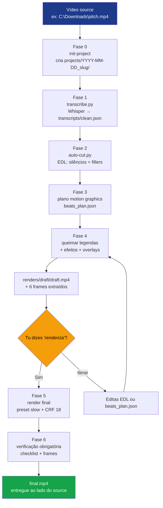

<div align="center">
  

  # videokit

  **Editor autónomo de vídeo com IA, como Skill do Claude Code.**

  Transcrição Whisper · Corte automático · Legendas queimadas · Motion graphics · LUTs cinematográficos · Reframe 16:9 → 9:16 · Diarização · Tradução · TTS · Separação de áudio · Background removal

  [](#autoria)
  [](https://docs.anthropic.com/en/docs/claude-code)
  [](https://ffmpeg.org)
  [](https://python.org)

  **Línguas:** Português · [English](README.en.md)

</div>

---

## Índice

- [O que é](#o-que-é)
- [Funcionalidades](#funcionalidades)
- [Como funciona](#como-funciona)
- [Instalação](#instalação)
- [Como usar — passo a passo](#como-usar--passo-a-passo)
- [Estrutura completa do projeto](#estrutura-completa-do-projeto)
- [Limitações](#limitações)
- [Roadmap](#roadmap)
- [Lessons learned](#lessons-learned-ffmpeg-8x-gotchas)
- [Autoria](#autoria)

---

## O que é

Editor automático de vídeo conversacional. Dás-lhe um vídeo, dizes o que queres, ele faz. Operações disponíveis: transcrição, corte de silêncios/fillers, legendas queimadas, motion graphics, color grading com LUTs, transições, reframe 9:16, áudio profissional, diarização, tradução, narração TTS, separação de stems e background removal — tudo a partir de uma única instrução no Claude Code, sem mexeres em scripts manualmente.

**Diferenciadores:**
- Conversacional (não precisas de aprender argumentos de FFmpeg)
- Cross-platform (Windows PowerShell + macOS/Linux Bash)
- Auto-instala pré-requisitos (FFmpeg, Python, pacotes pip) com permissão
- Output ao lado do source — nunca dentro da skill
- Verificação obrigatória antes de declarar "pronto" (checklist + 6 frames)

---

## Funcionalidades

### Pipeline core (sempre disponível)

| Capacidade | Implementação |
|---|---|
| **Transcrição** | Whisper local (default, offline, gratuito), OpenAI API ou ElevenLabs API |
| **Corte automático** | Remove silêncios >0.5s, fillers PT (`ahn`, `tipo`, `né`, `pronto`...) e EN (`um`, `like`, `you know`...) |
| **Legendas queimadas (ASS)** | 3 estilos: `full` (1-2 linhas), `karaoke` (word-by-word), `highlights` (palavras-chave grandes) |
| **Motion graphics** | Title cards e lower thirds HTML com alpha (Google Fonts, animações CSS) |
| **Reframe 16:9 → 9:16** | Tracking de cara via MediaPipe BlazeFace. Opcional X+Y tracking. Suporta 9:16, 1:1, 4:5 |
| **LUTs e color grading** | 13 LUTs procedurais (`identity`, `warm`, `cool`, `cinematic`, `bw`, `pastel`, `vintage`, `noir`, `vibrant`, `faded`, `golden-hour`, `teal-cool`, `high-contrast`) + vignette + film grain |
| **Transições** | 40+ via FFmpeg `xfade` (fade, slide, wipe, circleopen, dissolve, radial, pixelize...) |
| **Áudio profissional** | Denoise RNNoise + normalize EBU R128 (-14 LUFS YouTube / -16 Reels / -13 TikTok) + compressor + de-esser + ducking sidechain de música |
| **Verificação obrigatória** | Checklist booleano (duração, áudio, codec, legendas) + ≥6 frames extraídos para revisão visual |

### Features avançadas (opt-in)

| Capacidade | Implementação | Trigger |
|---|---|---|
| **Diarização** | pyannote-audio identifica `SPEAKER_00`, `SPEAKER_01`... | `"podcast com 2 oradores"` |
| **Tradução de legendas** | argos-translate offline PT↔EN/ES/FR/IT/DE (ASS e SRT) | `"traduz legendas para inglês"` |
| **TTS narração** | Piper local: vozes PT-PT (tugão), PT-BR (faber/edresson), EN-US (amy/lessac), EN-GB (alan), ES, FR | `"gera narração para este texto"` |
| **Separação de áudio** | Demucs separa vocals/drums/bass/other ou two-stems | `"remove a música deste vídeo"` |
| **Background removal** | rembg/U²-Net sem greenscreen (alpha / replace / blur) | `"remove o fundo com blur"` |

---

## Como funciona



Fluxo simplificado em 6 passos:
1. **Instalas** a skill uma vez (clone + junction/symlink).
2. **Abres** Claude Code em qualquer pasta.
3. **Dizes** ao Claude `"edita este vídeo <path>"`.
4. **Primeira vez:** respondes a 7 perguntas de onboarding (cor da marca, estilo, etc.).
5. **Pipeline corre.** Vês um draft + 6 frames. Confirmas com `renderiza`.
6. **Recebes** `final.mp4` numa pasta `videokit-projects/` ao lado do source.

---

## Instalação

### Pré-requisitos

**A skill pode instalar tudo automaticamente** via `bootstrap.{ps1,sh}` (ver [Passo 4](#passo-4--bootstrap-automático-opcional)). Para referência:

| Ferramenta | Para quê | Auto via skill? |
|---|---|---|
| **Claude Code** | Runtime | ❌ chicken-and-egg |
| **FFmpeg 8.x** com libass | Pipeline vídeo/áudio | ✅ via bootstrap |
| **Python 3.12+** | Scripts de IA | ✅ via bootstrap |
| **Pacotes pip core** (whisper, mediapipe, opencv) | Pipeline base | ✅ via bootstrap |
| **Pacotes pip features** (pyannote, demucs, rembg...) | Avançado | ✅ via install-feature |
| **Node.js 22+** | HyperFrames (opcional, futuro) | ❌ não usado por defeito |

**Em macOS**, o bootstrap precisa de [Homebrew](https://brew.sh):
```bash
/bin/bash -c "$(curl -fsSL https://raw.githubusercontent.com/Homebrew/install/HEAD/install.sh)"
```

**Em Linux**, o bootstrap usa `apt` (Debian/Ubuntu). Outras distros:
- Fedora: `sudo dnf install ffmpeg python3 python3-pip`
- Arch: `sudo pacman -S ffmpeg python python-pip`
- openSUSE: `sudo zypper install ffmpeg-7 python312 python312-pip`

### Passo 1 — Clonar este repositório

**Windows (PowerShell):**
```powershell
cd $env:USERPROFILE\Documents
git clone https://github.com/antoniocostalopes/video-Kit.git videokit
```

**macOS / Linux:**
```bash
cd ~/Documents
git clone https://github.com/antoniocostalopes/video-Kit.git videokit
```

### Passo 2 — Ligar ao Claude Code

A skill tem de estar visível em `~/.claude/skills/`. Link simbólico (não duplica ficheiros):

**Windows (PowerShell, sem privilégios admin):**
```powershell
cmd /c mklink /J "$env:USERPROFILE\.claude\skills\videokit" "$env:USERPROFILE\Documents\videokit"
```

**macOS / Linux:**
```bash
ln -s ~/Documents/videokit ~/.claude/skills/videokit
```

### Passo 3 — Verificar

Abre o Claude Code (em qualquer pasta) e pergunta: `que skills tens disponíveis?` Deves ver `videokit` na lista.

Ou pelo terminal:
```powershell
Test-Path "$env:USERPROFILE\.claude\skills\videokit\SKILL.md"  # True
```

### Passo 4 — Bootstrap automático (opcional)

A skill pode auto-instalar FFmpeg, Python 3.12+ e pacotes pip core. Se a primeira invocação detetar algo em falta, oferece-se para instalar. Para fazer manualmente:

**Windows (sem admin, via winget):**
```powershell
& "$env:USERPROFILE\.claude\skills\videokit\scripts\bootstrap.ps1"
```

**macOS (precisa Homebrew):**
```bash
bash ~/.claude/skills/videokit/scripts/bootstrap.sh
```

**Linux (Debian/Ubuntu, precisa sudo):**
```bash
bash ~/.claude/skills/videokit/scripts/bootstrap.sh
```

Flags úteis:
- `--auto-yes` / `-AutoYes` — não pergunta, instala tudo
- `--check-only` / `-CheckOnly` — só reporta o estado
- `--skip-ffmpeg` / `--skip-python` / `--skip-pip` — salta componentes

### Passo 5 — Detect ambiente (automático no 1º uso)

Após bootstrap, a skill corre `scripts/detect-env.{ps1,sh}` que escreve `cache/env-report.json` com paths do FFmpeg, Python e capacidades disponíveis.

### Feature packs sob demanda

Funcionalidades avançadas (diarização, tradução, TTS, separação de áudio, background removal) são opt-in. A skill pergunta antes de instalar quando pedires uma destas pela primeira vez. Para instalar manualmente:

| Feature | Pacotes | Download | Notas |
|---|---|---|---|
| `core` | whisper + mediapipe + opencv-python | ~300MB | base, instalado pelo bootstrap |
| `diarization` | pyannote.audio + torch | ~500MB | precisa `HF_TOKEN` env var |
| `translation` | argostranslate | ~150MB | +100MB por par de línguas |
| `tts` | piper-tts | ~50MB | +50-100MB por voz |
| `audio-separation` | demucs + torch | ~2GB | inclui modelos |
| `bg-removal` | rembg + opencv-python | ~250MB | inclui U²Net |
| `all` | tudo | ~5GB | one-shot |

```powershell
# Windows
.\install-feature.ps1 diarization
.\install-feature.ps1 all
```

```bash
# macOS / Linux
./install-feature.sh diarization
./install-feature.sh all
```

---

## Como usar — passo a passo

### Primeira utilização — onboarding (5 minutos, uma vez)

Quando invocas a skill pela primeira vez, faz 7 perguntas uma de cada vez. Resposta guardada em `~/.claude/skills/videokit/styles/client-style.md`. Aplica-se a todos os vídeos futuros.

> **Tu:** `configura o videokit para a minha marca`
>
> **Claude:** Vou criar o teu perfil. Cor principal? (hex, nome, ou `default`)
>
> **Tu:** `#2563EB`
>
> **Claude:** Cor secundária?
>
> **Tu:** `default`
>
> **Claude:** Estilo de edição? `minimalista` / `dinâmico` / `corporativo` / `educativo`
>
> **Tu:** `dinâmico`
>
> **Claude:** Posição habitual do orador? `centro` / `direita` / `esquerda`
>
> **Tu:** `centro`
>
> **Claude:** Logo? (caminho absoluto ou `não`)
>
> **Tu:** `não`
>
> **Claude:** Estilo default de legendas? `completas` / `karaoke` / `highlights` / `sem`
>
> **Tu:** `karaoke`
>
> **Claude:** Transcritor preferido? `Whisper local` / `OpenAI` / `ElevenLabs`
>
> **Tu:** `Whisper local`
>
> **Claude:** Estilo guardado. Já posso editar os teus vídeos. Quando quiseres editar, passa-me o caminho: `edita C:\caminho\video.mp4`.

### Sessão típica — edição completa

> **Tu:** `edita este vídeo C:\Downloads\pitch-ia.mp4`
>
> **Claude:** Vou criar o projeto. Antes de começar:
>
> 1. Estilo de legendas para **este** vídeo (default do teu perfil é karaoke)?
> 2. Modo: `full` (motion graphics) ou `cut-only`?
> 3. Algum contexto importante? (termos técnicos, foco)
>
> **Tu:** `karaoke, full, é um pitch sobre agentes IA com termos "MCP", "RAG", "embedding"`
>
> **Claude:**
> ```
> A executar detect-env... ✓
> A criar C:\Downloads\videokit-projects\2026-06-03_pitch-ia\
> Source detetado: 1920×1080 @ 30fps, 4m12s, 16:9
>
> Fase 1/6 — Transcrição (Whisper medium, ~2min)...
> ✓ 87 segmentos, 1124 palavras (PT detetado)
>
> Fase 2/6 — Análise para corte...
> ✓ Silêncios: 23 (-12.4s) · Fillers: 41 · Duração final 3m26s
>
> Fase 3/6 — Plano motion graphics... ✓ 5 beats + 2 efeitos zoompan
>
> Fase 4/6 — Queimar legendas karaoke + overlays...
> Fase 5/6 — Gerar draft (~1min)...
>
> ✓ Draft pronto em renders/draft/draft.mp4
> ✓ 6 frames extraídos para verify/
>
> Vê e diz 'renderiza' para final, ou pede ajustes.
> ```
>
> **Tu:** `o zoom aos 2m48s está exagerado, reduz para 1.15× e renderiza`
>
> **Claude:**
> ```
> Ajustar beats_plan.json.video_effects[id=vfx02].max_zoom: 1.25 → 1.15
> A regenerar fases 4-5 (preset slow, ~3min)...
>
> Fase 6/6 — Verificação...
> ✓ Duração: 3m26s · Áudio: -14 LUFS · Codec h264 yuv420p
> ✓ Legendas sincronizadas · Zoom em 2m48s confirmado
>
> Pronto.
> 📁 C:\Downloads\videokit-projects\2026-06-03_pitch-ia\renders\final\final.mp4
> ⏱️ 3m26s · 87 MB · 6 frames de revisão em verify/
> ```

### Cheatsheet de comandos

| Quando | O que dizes | Efeito |
|---|---|---|
| **Início** | `edita C:\v.mp4` | Pipeline completo `full` |
| **Início** | `corta os silêncios em C:\v.mp4` | Modo `cut-only` |
| **Início** | `corta os ahn / tipo / né em C:\v.mp4` | Cut-only com fillers PT |
| **Início** | `limpa o áudio em C:\v.mp4` | Pack áudio (denoise + normalize + compressor) |
| **Início** | `versão Reels de C:\v.mp4` | Smart reframe 16:9 → 9:16 |
| **Início** | `versão Reels com tracking vertical` | Smart reframe X+Y |
| **Início** | `versão quadrada de C:\v.mp4` | Smart reframe 1:1 |
| **Início** | `quem fala em cada parte de C:\podcast.mp4?` | Diarização (SPEAKER_NN) |
| **Início** | `podcast com 2 oradores, mete nomes nas legendas` | Diarize + legendas com nome |
| **Início** | `remove a música do C:\v.mp4` | Demucs separa, mantém voz |
| **Início** | `isola só a voz para karaoke` | Demucs vocals + no_vocals |
| **Início** | `remove o fundo do C:\v.mp4 com blur` | rembg modo blur |
| **Início** | `troca fundo por imagem C:\bg.jpg` | rembg modo replace |
| **Início** | `gera narração para este texto com voz PT-PT` | Piper TTS pt_PT-tugao |
| **Antes de transcrever** | `usa OpenAI Whisper em vez do local` | Override transcritor |
| **Após draft** | `renderiza` / `está bom` | Avança para final |
| **Após draft** | `muda cor das legendas para vermelho` | Edita ASS + re-render |
| **Após draft** | `tira o card do início` | Remove beat[0] |
| **Após draft** | `acelera 1.1× a partir de 1m30s` | setpts em beats_plan |
| **Após draft** | `também versão 9:16` | Smart reframe pós-final |
| **Após draft** | `traduz legendas para inglês` | argos-translate ASS → EN |
| **Após final** | `aplica look cinematográfico` | LUT cinematic + grade |
| **Após final** | `aplica look pastel` | LUT pastel + grade |
| **Após final** | `aplica look golden hour` | LUT golden-hour + grade |
| **Após final** | `aplica look noir` | LUT noir + alto contraste |

### Como iterar depois do primeiro render

Mudanças visuais são rápidas — a skill toca só no afetado:

| Pedido | O que muda | Tempo |
|---|---|---|
| `muda cor das legendas para verde` | `edit/subtitles.ass` → re-burn | ~30s |
| `move lower-third para 45s` | `beats_plan.json` timestamp → recompõe | ~30s |
| `tira o zoom aos 2m48s` | `beats_plan.json.video_effects` → re-render base | ~1min |
| `corta também aos 1m20s` | `edit/edl.json` → re-cut → re-render | ~3min (timestamps deslocam) |
| `aplica LUT warm em vez de cinematic` | re-corre visual-effects | ~1min |
| `também versão 9:16 deste final` | smart-reframe pós-final | ~3min (1080p 1min) |

A skill **avisa** quando uma mudança implica re-correr fases anteriores.

### Cenários por tipo de vídeo

#### 1. Talking head para YouTube longo (16:9)
```
edita C:\Videos\episode-03.mp4 com legendas completas e look corporativo
```
16:9 1920×1080, legendas brancas com outline preto, lower thirds discretos, áudio normalizado -14 LUFS.

#### 2. Reel/Short de Instagram (9:16)
```
edita C:\Videos\hook.mp4 com legendas karaoke e versão Reels
```
Pipeline 16:9 → smart-reframe 9:16 1080×1920. Karaoke word-by-word font 110px. Áudio -16 LUFS.

#### 3. Limpeza rápida sem motion graphics
```
corta os silêncios e os "tipo" em C:\Videos\raw.mov, sem motion graphics
```
Cut-only mode. EDL + concat + (opcional) legendas. Ideal para podcast vídeo, entrevista longa.

#### 4. Podcast — pack áudio standalone
```
limpa o áudio em C:\Audio\episode.mp4 e normaliza a -16 LUFS para podcast
```
Sem pipeline vídeo. Denoise RNNoise + de-esser + compressor + EBU R128 -16 LUFS.

#### 5. Screencast / tutorial
```
edita C:\Videos\demo.mp4, é um tutorial de código, zoom nas demos
```
Perfil screencast: legendas discretas, zoom subtil (1.15×) em demos, sem cards laterais.

#### 6. Promo cinematográfica
```
edita C:\Videos\promo.mp4 com look cinematic, vignette e legendas highlights
```
LUT cinematic.cube (teal-orange) + vignette 0.4 + film grain 5 + highlights em palavras-chave.

#### 7. Podcast com 2 oradores e diarização
```
edita C:\Podcasts\ep-12.mp4, diariza os 2 oradores e põe legendas com nome
```
Cut-only + `diarize.py --num-speakers 2`. Skill pergunta nomes reais ("João", "Maria") e prefixa cada Dialogue ASS.

#### 8. Vídeo multilíngue (legendas em EN/ES/FR)
```
edita C:\Videos\pitch-pt.mp4 e gera versões com legendas em EN, ES e FR
```
Pipeline em PT → `translate-subtitles.py` por cada língua → outputs queimados ou SRT externos.

#### 9. Narração TTS gerada
```
gera narração com voz PT-PT para o texto em C:\scripts\intro.txt, mistura com música C:\music\loop.mp3
```
`narrate.py --voice pt_PT-tugao --text-file intro.txt` → `audio-process.sh` ducking automático.

#### 10. Webcam-look (background blur)
```
remove o fundo do C:\Videos\talking.mp4 com blur, mantém qualidade
```
`remove-bg.py --mode blur --blur-strength 25`. Look "webcam pro" sem greenscreen.

#### 11. Substituir música de vídeo
```
remove a música do C:\Videos\vlog.mp4 e mete C:\music\nova.mp3 com volume baixo
```
`separate-audio.py --two-stems vocals` + `audio-process.sh --music nova.mp3 --music-volume 0.3`.

### Onde ficam os outputs

**Não dentro da skill.** Ao lado do vídeo source:

```
C:\Downloads\
├── pitch-ia.mp4                                  ← teu source (intacto)
└── videokit-projects\
    └── 2026-06-03_pitch-ia\
        ├── source\pitch-ia.mp4                   ← cópia local
        ├── transcripts\
        │   ├── raw.json                          ← saída crua Whisper
        │   ├── clean.json                        ← formato canónico
        │   └── diarization.json                  ← se diarizado
        ├── edit\
        │   ├── edl.json                          ← edita aqui para cortes
        │   ├── subtitles.ass                     ← edita aqui para legendas
        │   ├── subtitles_en.ass                  ← se traduzido
        │   └── segments\seg_001.mp4 ...
        ├── overlays\b01.mov, b02.mov, ...        ← motion graphics alpha
        ├── audio\stems\vocals.wav ...            ← se separado com demucs
        ├── renders\
        │   ├── draft\draft.mp4                   ← preview rápido
        │   └── final\final.mp4                   ⬅ ENTREGA
        ├── verify\
        │   ├── frame_1.000.png                   ← controlo
        │   └── ...                                ← ≥6 frames
        ├── cache\                                 ← temporários (apagáveis)
        ├── project.json                          ← estado completo
        ├── beats_plan.json                       ← motion graphics
        └── notes.md                              ← decisões e exceções
```

Apaga `2026-06-03_pitch-ia/` para limpar tudo desse vídeo. O source em `Downloads\` mantém-se intacto.

### Flags via slash command (alternativa à conversação)

```
/videokit C:\v.mp4 --mode cut-only --subs karaoke
/videokit C:\v.mp4 --mode full --subs highlights
/videokit C:\v.mp4 --mode full --subs sem
```

`argument-hint` em SKILL.md: `<caminho-absoluto-do-video> [--mode full|cut-only] [--subs full|karaoke|highlights|sem]`.

---

## Estrutura completa do projeto

```
videokit/
├── SKILL.md                    # Manifest + fluxo principal (lido pelo Claude)
├── README.md                   # Este ficheiro (PT)
├── README.en.md                # Versão inglesa
├── CHANGELOG.md                # Keep a Changelog + semver
├── CONTRIBUTING.md             # PR guidelines + code style
├── .gitignore                  # Ignora cache, modelos runtime, config privada
├── .github/
│   └── workflows/
│       └── validate.yml        # CI: PowerShell + Python + Bash + Markdown lint
│
├── reference/                  # 13 docs on-demand (lidas pelo Claude conforme necessário)
│   ├── pipeline.md             # 6 fases do pipeline (entrada → entrega)
│   ├── formats.md              # specs 16:9 / 9:16 / 1:1 / screencast (zonas seguras)
│   ├── onboarding.md           # primeira conversa (7 perguntas)
│   ├── subtitle-styles.md      # quando usar full / karaoke / highlights
│   ├── audio-pack.md           # denoise RNNoise + loudnorm + ducking
│   ├── visual-effects.md       # transições xfade + 13 LUTs + grading
│   ├── smart-reframe.md        # MediaPipe tracking X+Y
│   ├── diarization.md          # pyannote-audio SPEAKER_NN
│   ├── translation.md          # argos-translate offline
│   ├── tts.md                  # Piper TTS multi-língua
│   ├── audio-separation.md     # Demucs stem separation
│   ├── background-removal.md   # rembg sem greenscreen
│   └── lessons-learned.md      # gotchas FFmpeg 8.x, Windows, Whisper
│
├── scripts/                    # 27 scripts: 9 PowerShell + 9 Bash + 9 Python
│   │
│   │ ─── Setup e ambiente ───
│   ├── bootstrap.{ps1,sh}      # Auto-install FFmpeg + Python + pip core
│   ├── install-feature.{ps1,sh} # Install pip packages por feature pack
│   ├── detect-env.{ps1,sh}     # Deteta env, escreve cache/env-report.json
│   ├── download-assets.{ps1,sh} # Busca modelos runtime (RNNoise)
│   │
│   │ ─── Pipeline ───
│   ├── init-project.{ps1,sh}   # Cria videokit-projects/YYYY-MM-DD_slug/
│   ├── transcribe.py           # Whisper local + OpenAI + ElevenLabs
│   ├── auto-cut.py             # EDL: silêncios + fillers PT/EN/retakes
│   ├── burn-subtitles.{ps1,sh} # Queima ASS via ffmpeg subtitles filter
│   ├── audio-process.{ps1,sh}  # Denoise + normalize + compressor + ducking
│   ├── visual-effects.{ps1,sh} # Modes: transition / lut / grade
│   ├── render.{ps1,sh}         # Orquestrador (cut/subs/effects/overlays/verify)
│   │
│   │ ─── Features avançadas ───
│   ├── smart-reframe.py        # MediaPipe BlazeFace tracking X+Y
│   ├── diarize.py              # pyannote SPEAKER_NN + merge transcript
│   ├── translate-subtitles.py  # argos-translate ASS/SRT cross-língua
│   ├── narrate.py              # Piper TTS PT-PT/PT-BR/EN/ES/FR
│   ├── separate-audio.py       # Demucs vocals/drums/bass/other
│   ├── remove-bg.py            # rembg alpha/replace/blur
│   │
│   │ ─── Generators ───
│   └── gen-luts.py             # Gera 13 LUTs procedurais .cube
│
├── assets/
│   ├── icon.svg                # Logo da skill (140×140 no README)
│   ├── subtitle-templates/     # 3 templates .ass (UTF-8 sem BOM)
│   │   ├── full.ass            # 1-2 linhas completas
│   │   ├── karaoke.ass         # word-by-word com {\k}
│   │   └── highlights.ass      # palavras-chave grandes (alignment 5)
│   ├── beat-templates/         # 2 templates HTML com alpha
│   │   ├── title-card.html     # Título grande + subtítulo (fade-in)
│   │   └── lower-third.html    # Nome + cargo (slide-in left/right/center)
│   ├── luts/                   # 13 LUTs procedurais (134KB cada)
│   │   ├── identity.cube       # sem efeito (baseline)
│   │   ├── warm.cube           # golden hour, sunset
│   │   ├── cool.cube           # winter, tech
│   │   ├── cinematic.cube      # teal-orange clássico
│   │   ├── bw.cube             # B&W contraste suave
│   │   ├── pastel.cube         # lifestyle, wellness
│   │   ├── vintage.cube        # sepia, fade nos pretos
│   │   ├── noir.cube           # B&W high contrast + blue shadows
│   │   ├── vibrant.cube        # alta saturação + S-curve
│   │   ├── faded.cube          # Instagram filter classic
│   │   ├── golden-hour.cube    # warm intense, magic hour
│   │   ├── teal-cool.cube      # modern tech, saturated cool
│   │   └── high-contrast.cube  # bold blacks + brights
│   ├── audio-models/           # RNNoise cb.rnnn (download runtime, gitignored)
│   ├── face-detector/          # BlazeFace .tflite (download runtime, gitignored)
│   └── voice-models/           # Piper .onnx (download runtime, gitignored)
│
└── cache/                      # env-report.json (estado local, gitignored)
```

---

## Limitações

- **Single-pass loudnorm**: ~0.5 LUFS imprecisão vs. two-pass. Aceitável para conteúdo digital.
- **Smart reframe X+Y**: tracking de cara funciona bem; em movimento muito rápido pode ter "saltos".
- **Whisper CPU**: ~5× tempo real em 1080p com modelo `medium`. GPU NVIDIA acelera 10× mas exige setup CUDA.
- **Sem chroma key removal**: para greenscreen tens de processar antes.
- **Diarização em PT**: razoável; vozes muito similares (mesmo género/idade) podem confundir.
- **Linux outras distros**: bootstrap só suporta apt (Debian/Ubuntu) automaticamente. Outras precisam de manual.
- **macOS Homebrew**: chicken-and-egg — tens de instalar brew primeiro (uma linha curl).

---

## Roadmap

Funcionalidades planeadas (PRs bem-vindas):

- [ ] **B-roll automático** via Pexels API — keywords da transcrição → vídeos de stock
- [ ] **Chapter markers automáticos** — YouTube chapters file
- [ ] **Stable Diffusion thumbnails** — frame + título overlay automático
- [ ] **Hook detection** — primeiros 3-5s mais fortes para auto-trim Reels
- [ ] **GPU end-to-end** — NVENC + Whisper.cpp + CUDA OpenCV (10× speedup)
- [ ] **Multi-format auto-export** — 1 source → YouTube 16:9 + Reels 9:16 + Square 1:1 em paralelo
- [ ] **Auto-thumbnail** com frame + título overlay
- [ ] **Watch folder mode** — daemon que monitoriza pasta e processa novos vídeos
- [ ] **Pyannote refinamento** — diarização com voice samples por orador (nome real)
- [ ] **NLLB-200** alternativa ao argos-translate (200 línguas, qualidade superior)
- [ ] **Tests** (Pester + pytest) — confiança em mudanças futuras
- [ ] **Real-time progress** via JSON stdout — UI/dashboards externos

### Já implementado nesta versão

- ✅ **Pipeline core** — transcribe, auto-cut, burn-subtitles, motion graphics, verify
- ✅ **Pack áudio** — denoise RNNoise, EBU R128, compressor, ducking
- ✅ **Pack visual** — 40+ xfade transitions, 13 LUTs procedurais, vignette, film grain
- ✅ **Smart reframe** 16:9 → 9:16/1:1/4:5 com tracking X+Y (MediaPipe)
- ✅ **Diarização** pyannote-audio com SPEAKER_NN
- ✅ **Tradução** argos-translate PT↔EN/ES/FR/IT/DE
- ✅ **TTS local** Piper com 8 vozes catalogadas
- ✅ **Separação de áudio** Demucs (4-stem ou two-stems)
- ✅ **Background removal** rembg/U²-Net (alpha/replace/blur)
- ✅ **Auto-install** FFmpeg + Python + pip core via bootstrap
- ✅ **Feature packs** install-feature por funcionalidade
- ✅ **Cross-platform** Windows + macOS + Linux (PS + Bash)
- ✅ **GitHub Actions CI** validate.yml para PRs

---

## Lessons learned (FFmpeg 8.x gotchas)

Em `reference/lessons-learned.md` documento bugs reais e workarounds. Exemplos:

- **`crop` com `t` em FFmpeg 8.x não reavalia o filtro por frame** → zoom temporal congela. Usar `zoompan` com `in_time` (`d=1`).
- **`-c copy` sozinho em cortes desincroniza packets AAC** → sempre `-c:a aac -b:a 192k`.
- **Filtro `subtitles` em Windows não aceita paths com `:`** → copiar `.ass` para a pasta do output e referenciar pelo nome (`Push-Location`).
- **iPhone MOV multi-stream** (AAC + spatial 4ch) → `-map 0:a:0` para apanhar o stereo certo.
- **PowerShell 5.1 trata stderr de exes nativos como erro** → `Start-Process -RedirectStandardError` em vez de `2>&1`.
- **`subprocess` PIPE com ffmpeg em Python pode deadlock** → stderr para tempfile, não PIPE.
- **MediaPipe 0.10.x removeu `mp.solutions`** → usar Tasks API com `.tflite` descarregado.
- **PowerShell `$Input`** é reservado → usar `$InputFile` em parâmetros.

Se apanhares um bug FFmpeg num cenário não coberto, abre um issue ou PR com o workaround.

---

## Autoria

**videokit** foi concebido, arquitetado e desenvolvido por **Antonio Costa Lopes** em 2026.

© 2026 Antonio Costa Lopes.

Este repositório não declara uma licença pública. O código é da autoria do autor e está sujeito ao copyright automático aplicável (Convenção de Berna). Para discutir uso, abre uma [issue](https://github.com/antoniocostalopes/video-Kit/issues).

### Componentes de terceiros

videokit é um orquestrador que invoca ferramentas externas. Estas ferramentas mantêm as suas próprias licenças e termos de uso — não são redistribuídas por este repositório:

- **FFmpeg** — LGPL/GPL ([ffmpeg.org/legal.html](https://ffmpeg.org/legal.html))
- **OpenAI Whisper** — MIT
- **MediaPipe BlazeFace** — Apache 2.0 (Google, modelo `.tflite` descarregado em runtime)
- **pyannote-audio** — MIT (mas modelo `speaker-diarization-3.1` precisa de aceitar termos no HuggingFace)
- **argos-translate** — MIT (pacotes de línguas CC-BY)
- **Piper TTS** — MIT (vozes têm licenças individuais, maioria permissivas)
- **Demucs** — MIT (Facebook AI Research)
- **rembg + U²-Net** — Apache 2.0
- **RNNoise** model `cb.rnnn` — Creative Commons Attribution 4.0 (CC-BY 4.0), por GregorR ([github.com/GregorR/rnnoise-models](https://github.com/GregorR/rnnoise-models))
- **OpenCV** — Apache 2.0
- **PyTorch** — BSD

Os scripts `download-assets.{ps1,sh}`, `smart-reframe.py`, `narrate.py`, `separate-audio.py`, `remove-bg.py`, `diarize.py`, e `translate-subtitles.py` descarregam os modelos diretamente das fontes oficiais. Nenhum modelo é incluído neste repositório (todos `.gitignored`).

---

<div align="center">
  <sub>Built for Claude Code · Antonio Costa Lopes · 2026</sub>
</div>
